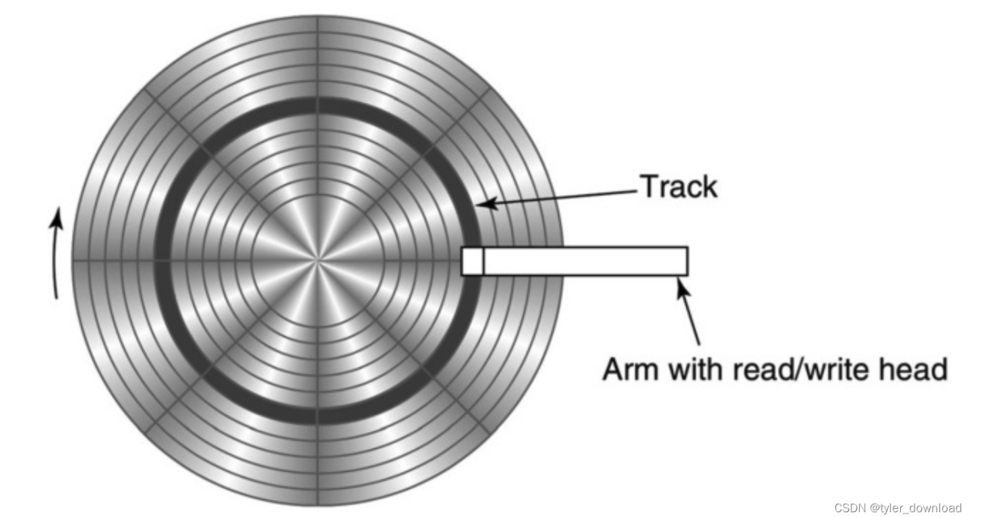
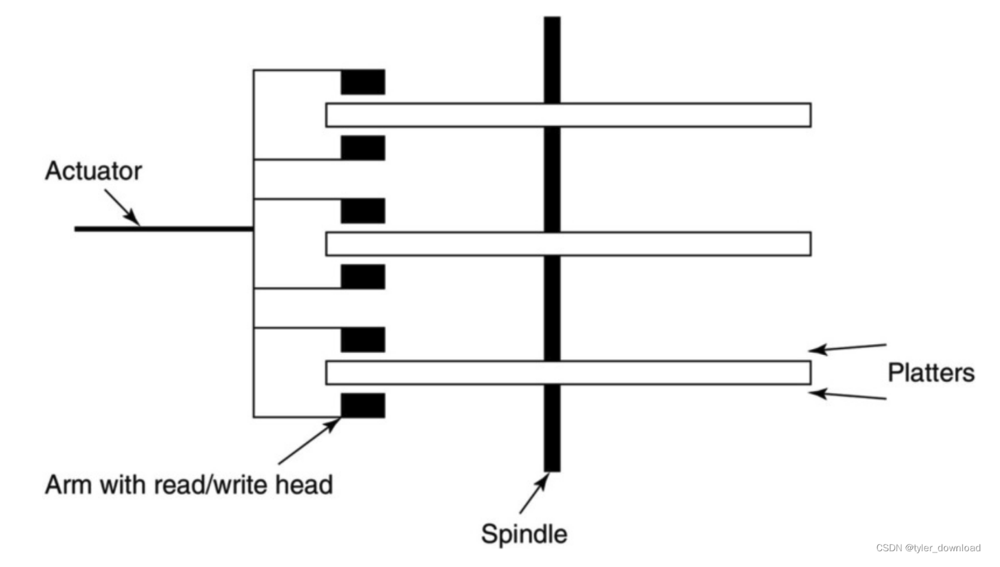

目前数据库分为两大类一类就是Mysql这种，基于文件系统，另一类是redis，完全基于内存。

前者的设计比后者要复杂得多，原因在于前者需要将大量数据存放在磁盘上，而磁盘相比于内存，其读写速度要慢上好几个数量级，因此如何组织数据在磁盘上存放，如何通过操控磁盘尽可能减少读写延迟，这就需要设计精妙而又复杂的算法。首先我们先看看为何基于文件的数据库系统要充分考虑并且利用磁盘的特性。

一个磁盘通常包含多个可以旋转的磁片，磁片上有很多个同心圆，也称为”轨道“，这些轨道是磁盘用于存储数据的磁性物质。而轨道也不是全部都能用于存储数据，它自身还分成了多个组成部分，我们称为扇区，扇区才是用于存储数据的地方。扇区之间存在缝隙，这些缝隙无法存储数据，因此磁头在将数据写入连续多个扇区时，需要避开这些缝隙。

磁片有上下两面，因此一个磁片会被两个磁头夹住，当要读取某个轨道上的数据时，磁头会移动到对应轨道上方，然后等盘片将给定扇区旋转到磁头正下方时才能读取数据，盘片的结构如下:

一个磁盘会有多个盘片以及对应的磁头组成，其基本结构如下：

从上图看到，每个盘片都被两个磁头夹住，这里需要注意的是，所有磁头在移动时都必须同时运动，也就是当某个磁头想要读取某个轨道时，所有磁头都必须同时移动到给定轨道，不能说一个磁头移动到第10轨道，让后另一个磁头挪到第8轨道，同时在同一时刻只能有一个磁头进行读写，基于这些特点使得磁片的读写速度非常慢。

有四个因素会影响影响磁盘读写速度，分别为**容量，旋转速度，传输速度和磁头挪道时间**。

- 容量就是整个磁盘所能存储的数据量，现在一个盘片的数据容量能达到40G以上。
- 旋转速度是指磁盘旋转一周所需时间，通常情况下磁盘一分钟能旋转5400到15000转。
- 传输速率就是数据被磁头最后输送到内存的时间。
- 磁头挪道时间是指磁头从当前轨道挪动到目标轨道所需要的时间，这个时间最长就是当磁头从最内部轨道移动到最外部轨道所需时间，为了后面方便推导，我们磁头挪动的平均时间设置为5ms。

假设我们有一个2个盘片的磁盘，磁盘移动的平均时间是5ms，其一分钟能转10000圈，每个盘面包含10000个轨道，每个轨道包含500000字节，于是我们能得到以下数据:

- 首先是磁盘容量，它的计算为 500,000字节/轨道 \* 10000 个轨道/盘面 \* 4个盘面 = 20,000,000,000字节，大概是20G
- 我们看看传输率，一分钟能转10000圈，于是一秒能转10000 / 60 = 166圈，一个轨道含有500000字节，于是一秒能读取 166 \* 500000 这么多字节，约等于83M。

接下来我们计算一下**磁盘的读写速度**，这个对数据库的运行效率影响很大。

- 我们要计算的第一个数据叫旋转延迟，它的意思是当磁头挪到给定轨道后，等待磁盘将数据起始出旋转到磁头正下方的时间，显然我们并不知道要读取的数据在轨道哪个确切位置，因此我们认为平均旋转0.5圈能达到给定位置，由于1秒转166圈，那么转一圈的时间是 (1 / 166)秒，那么转半圈的时间就是(1 / 166) * 0.5 约等于 3ms。
- 我们看传输1个字节所需时间，前面我们看到1秒读取大概83MB的数据，也就是1秒读取83,000,000字节，于是读取一个字节的时间是 (1 / 83,000,000) 大概是0.000012ms。于是传输1000字节也就是1MB的时间是0.000012 * 1000 也就是0.012毫秒.

1字节读入内存的时间：

* 首先是磁头挪到给定字节所在的轨道，5ms
* 给定1字节所在位置旋转到磁头下方，也就是3ms
* 1字节传输到内存0.000012ms
* 总共8.000012ms

连续1000字节读入内存的时间

* 首先是磁头挪到给定字节所在的轨道，5ms
* 给定1000字节所在位置旋转到磁头下方，也就是3ms
* 1000字节传输到内存0.012ms
* 总共8.012ms

我们看到读取1000个字节所需时间跟读取1个字节所需时间几乎相同，因此要加快读写效率，一个方法就是依次读写大块数据。前面我们提到过一个轨道由多个扇区组成，磁盘在读写时，一次读写的最小数据量就是一个扇区的大小，通常情况下是512字节。

由于磁盘读写速度在毫秒级，而内存读写速度在纳秒级，因此磁盘读写相等慢，这就有必要使用某些方法改进读写效率。

一种方法是**缓存**，磁盘往往会有一个特定的缓冲器，它一次会将大块数据读入缓存，等下次程序读取磁盘时，它现在缓存里查看数据是否已经存在，存在则立即返回数据，要不然再从磁盘读取。这个特性对数据库系统来说作用不大，因此后者必然会有自己的缓存。磁盘缓存的一个作用在于预获取，当程序要读取给定轨道的第1个扇区，那么磁盘会把整个轨道的数据都读入缓存，比较读取整个轨道所用时间并不比读取1个扇区多多少。

我们前面提到过，当磁头移动时，是所有磁头同时移动到给定轨道，这个特性就有了优化效率的机会，如果我们把同一个文件的的数据都写入到不同盘面上的同一个轨道，那么读取文件数据时，我们只需要挪到磁头一次即可，这种不同盘面的同一个轨道所形成的集合叫柱面。如果文件内容太大，所有盘面上同一个轨道都存放不下，那么另一个策略就是将数据存放到相邻轨道，这样磁头挪动的距离就会短。

另一种改进就是使用多个磁盘，我们把一个文件的部分数据存储在第一个磁盘，另一部分数据存储在其他磁盘，由于磁盘数据的读取能同步进行，于是时间就能同步提升。通常情况下，”民用“级别的数据库系统不需要考虑磁盘结构，这些是操作系统控制的范畴，最常用的MySQL数据库，它对磁盘的读写也必须依赖于操作系统，因此我们自己实现数据库时，也必然要依赖于系统。

因此在实现上我们将采取的方案是，我们把数据库的数据用系统文件的形式存储，但是我们把系统文件抽象成磁盘来看待，在磁盘读写中，我们通常把若干个扇区作为一个统一单元来读写，这个统一单元叫块区，于是当我们把操作系统提供的文件看做”磁盘“时，我们读写文件也基于”块区“作为单位，这里看起来有点抽象，在后面代码实现中我们会让它具体起来。
